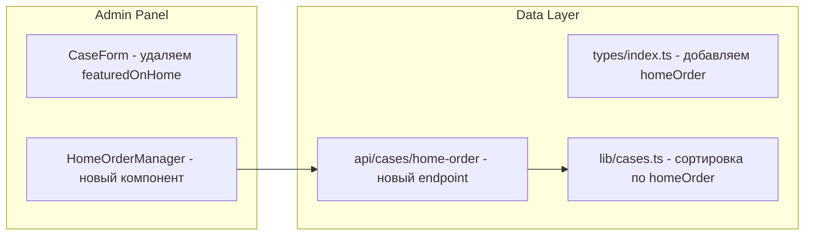

# Управление порядком кейсов на главной

## Архитектура изменений



## 1. Изменение типов данных

В [types/index.ts](types/index.ts) добавить поле:

```typescript
export interface Case {
  // ... existing fields ...
  homeOrder: number | null; // null = не показывать, 1-6 = позиция на главной
}
```

- `featuredOnHome` оставляем для обратной совместимости (deprecated), но используем `homeOrder`

## 2. Создание компонента HomeOrderManager

Новый файл `components/admin/HomeOrderManager.tsx`:
- Использует Framer Motion `Reorder.Group` и `Reorder.Item`
- Показывает 2 колонки: "На главной" (до 6 кейсов) и "Доступные кейсы"
- Drag-and-drop между колонками и внутри "На главной" для сортировки
- Кнопка сохранения порядка

## 3. Новый API endpoint

Файл `app/api/cases/home-order/route.ts`:
- PUT endpoint для массового обновления `homeOrder` у кейсов
- Принимает массив `{ id: string, homeOrder: number | null }[]`

## 4. Обновление lib/cases.ts

Функция `getFeaturedCases()`:

```typescript
export async function getFeaturedCases(): Promise<Case[]> {
  const cases = await getAllCases();
  return cases
    .filter((c) => c.published && c.homeOrder !== null && c.homeOrder > 0)
    .sort((a, b) => (a.homeOrder ?? 99) - (b.homeOrder ?? 99));
}
```

## 5. Изменения в CaseForm

В [components/admin/CaseForm.tsx](components/admin/CaseForm.tsx):
- Удаляем чекбокс `featuredOnHome` (строки 620-634)
- Поле управляется только через HomeOrderManager

## 6. Обновление страницы админки

В [app/[locale]/admin/page.tsx](app/[locale]/admin/page.tsx):
- Добавить вкладку/секцию "Главная страница" с HomeOrderManager

## Миграция данных

При первом запуске нужно будет вручную расставить порядок для существующих кейсов, или автоматически назначить `homeOrder` на основе текущего `featuredOnHome`.